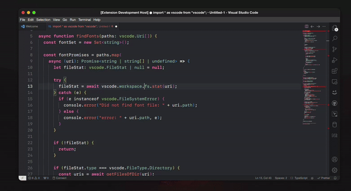

# Font Changer README

The Font Changer Extension for Visual Studio Code is a handy tool that allows you to easily change the fonts used in the code editor to any font installed on your computer. 

## Features

- *Font Selection*: Choose from fonts installed on your computer to customize the code editor's fonts.  
  

## Release Notes

### 0.0.5
- Windows fonts support

### 0.0.4
- Peformance improvement while previewing fonts
- MacOS system and local fonts support

### 0.0.3
- Fixed GIF explainer in the README

### 0.0.2 
- Added support for old versions of VSCode

### 0.0.1
- Added `Font Changer: Select Global Font` command

